# Aajiveka — Entity Relationship Diagram

Derived from a real restore of `db_aajiveka.bak`. The legacy database declares **zero**
foreign keys — every relation below was read out of the `JOIN … ON` clauses in `db/procs/`
and then **validated against the real data** with an orphan check. Confidence is recorded
per relation in `db/foreign-keys.psv`; the 13 dead tables in `db/dead-tables.txt` are omitted.

```mermaid
erDiagram
    CandidateDocumentMap }o..o| JobSubscriberMapping : "JobSubscriberMapID"
    CandidateDocumentMap }o..o| MstrDocumentType : "DocumentTypeID"
    CandidateDocumentUploaded }o..o| CandidateDocumentMap : "DocumentMapID"
    CandidateDocumentUploaded }o..o| MstrDocumentType : "DocumentTypeID"
    ClientContacts }o--|| ClientMstr : "ClientID"
    ClientJobSkill }o--|| ClientJobs : "JobID"
    ClientJobSkill }o--|| MstrSkills : "SkillID"
    ClientJobs }o--|| ClientMstr : "ClientID"
    ClientJobs }o--|| MstrCily : "JobCityID"
    ClientJobs }o--|| MstrDesignation : "DesignationID"
    ClientJobs }o--|| MstrEmpType : "EmployeeTypeID"
    ClientJobs }o--|| MstrIndustryType : "IndustryTypeID"
    ClientJobs }o--|| MstrWorkMode : "WorkModeID"
    ClientJobs_EducationType }o--|| ClientJobs : "JobID"
    ClientJobs_EducationType }o--|| MstrEducationType : "EducationTypeID"
    ClientJobs_Gendermapping }o--|| ClientJobs : "JobID"
    ClientMstr }o--|| MstrCily : "CityID"
    ClientMstr }o--|| MstrIndustryType : "IndustryTypeID"
    ClientMstr }o--|| SecUser : "UserID"
    JobInterviewStatus }o--|| JobSubscriberMapping : "JobSubscriberMapID"
    JobInterviewStatus }o--|| MstrInterviewMode : "InterviewModeID"
    JobSubscriberMapping }o--|| ClientJobs : "JobID"
    JobSubscriberMapping }o--|| MstrJobMappingStatus : "JobMapStatusID"
    JobSubscriberMapping }o--|| SubscriberRegistration : "SubscriberID"
    JobSubscriberStatus }o--|| JobSubscriberMapping : "JobSubscriberMapID"
    MstrCily }o--|| MstrState : "StateID"
    MstrCourse }o--|| MstrEducationType : "EducationTypeID"
    MstrEducationDegree }o--|| MstrEducationType : "EducationTypeID"
    MstrPerson }o--o| ClientMstr : "ClientID"
    MstrState }o--|| MstrCountry : "CountryID"
    MstrSubFunctions }o--|| MstrFunctions : "FunctionID"
    MstrTags }o--|| MstrSkills : "SkillID"
    SecMapUserRoles }o--|| SecRoles : "RoleId"
    SecMapUserRoles }o--|| SecUser : "UserID"
    SecUser }o--|| MstrPerson : "NodeID"
    SecUserLogin }o..o| SecUser : "UserID"
    SubscriberCVDetails }o--|| MstrCily : "CurrentCityID"
    SubscriberCVDetails }o--|| MstrIndustryType : "IndustryTypeID"
    SubscriberCVDetails }o--|| MstrSkills : "SkillID"
    SubscriberCVDetails }o--|| MstrSubFunctions : "SubFunctionID"
    SubscriberCVDetails }o--|| SubscriberRegistration : "SubscriberID"
    SubscriberCVDetails }o..o| MstrCily : "CityID"
    SubscriberCVUploaded }o..o| SubscriberRegistration : "SubscriberID"
    SubscriberCertificate }o--|| SubscriberRegistration : "SubscriberID"
    SubscriberEducation }o--|| SubscriberRegistration : "SubscriberID"
    SubscriberEducation }o..o| MstrCourseType : "CourseTypeID"
    SubscriberEducation }o..o| MstrEducationDegree : "DegreeID"
    SubscriberEmployer }o..o| MstrDesignation : "DesignationID"
    SubscriberEmployer }o..o| MstrEmpType : "EmployeeTypeID"
    SubscriberEmployer }o..o| SubscriberRegistration : "SubscriberID"
    SubscriberJobStatusLatest }o--o| ClientJobs : "JobID"
    SubscriberJobStatusLatest }o--o| ClientMstr : "ClientID"
    SubscriberJobStatusLatest }o--o| JobSubscriberMapping : "JobSubscriberMapID"
    SubscriberJobStatusLatest }o--o| MstrJobMappingStatus : "JobMapStatusID"
    SubscriberJobStatusLatest }o--|| SubscriberRegistration : "SubscriberID"
    SubscriberPrefferedLocations }o--|| MstrCily : "CityID"
    SubscriberPrefferedLocations }o--|| SubscriberRegistration : "SubscriberID"
    SubscriberStatusHistory }o--|| ClientJobs : "JobID"
    SubscriberStatusHistory }o--|| ClientMstr : "ClientID"
    SubscriberStatusHistory }o--|| MstrStatus : "StatusID"
    SubscriberStatusHistory }o..o| SecUser : "UserID"
    SubscriberStatusHistory }o..o| SubscriberRegistration : "SubscriberID"
    SubscriberTags }o--|| MstrTags : "TagID"
    SubscriberTags }o--|| SubscriberRegistration : "SubscriberID"
```

**Legend** — `}o--||` confirmed against data (0 orphans) · `}o--o|` real relation where `0`
is used as a *no value* sentinel (migrate `0 → NULL`) · `}o..o|` unverified (child table is
empty) or carrying pre-existing orphans.

## Columns that LOOK like foreign keys but are not

Name-matching finds these; the data does not contradict them; and they are still wrong.
Each was caught by reading the procedure that actually uses the column:

| Column | Looks like | Actually |
|---|---|---|
| `tblClientJobs.StatusID` | `tblMstrStatus` | A flag. `spClientGetJoblisting` reads it as `CASE WHEN StatusID = 1 THEN 'Active' ELSE 'Closed' END`. `tblMstrStatus` is the **candidate** journey (Account created → CV approved → Shortlisted → Selected), not a job status. The orphan check passed only because `StatusID` 1 exists there as *"Account created"* — which is exactly what the employer's job list used to display. |
| `tblJobSubscriberStatus.StatusID` | `tblMstrStatus` | Its own `IDENTITY` surrogate key. A column cannot be both. |
| `tblMstrDocumentStatus.StatusID` | `tblMstrStatus` | Same — its own identity key. |
| `tblMstrPerson.PersonNodeID` | → `tblSecUser.NodeID` | The direction is **reversed**: `tblSecUser.NodeID` → `tblMstrPerson.PersonNodeID`. |
| `tblClientMstr.UserID` | The login→company link | `NULL` on every row. The real path is `SecUser.NodeID` → `MstrPerson.PersonNodeID` → `MstrPerson.ClientID`. |

## Relations that carry dirty data

Genuine referential-integrity violations already present in the legacy data. They must be
cleaned before the FK can be enforced, or the load will fail:

| Relation | Problem |
|---|---|
| `tblSecUserLogin.UserID → tblSecUser.UserID` | 647 of 2,225 login rows point at users that no longer exist. It is an audit log, so this is expected — the migration NULLs them. |
| `tblSubscriberStatusHistory.SubscriberID` | 12 of 70 rows reference deleted subscribers (18–24). |
| `tblSubscriberStatusHistory.UserID` | 12 of 70 rows reference deleted users. |
